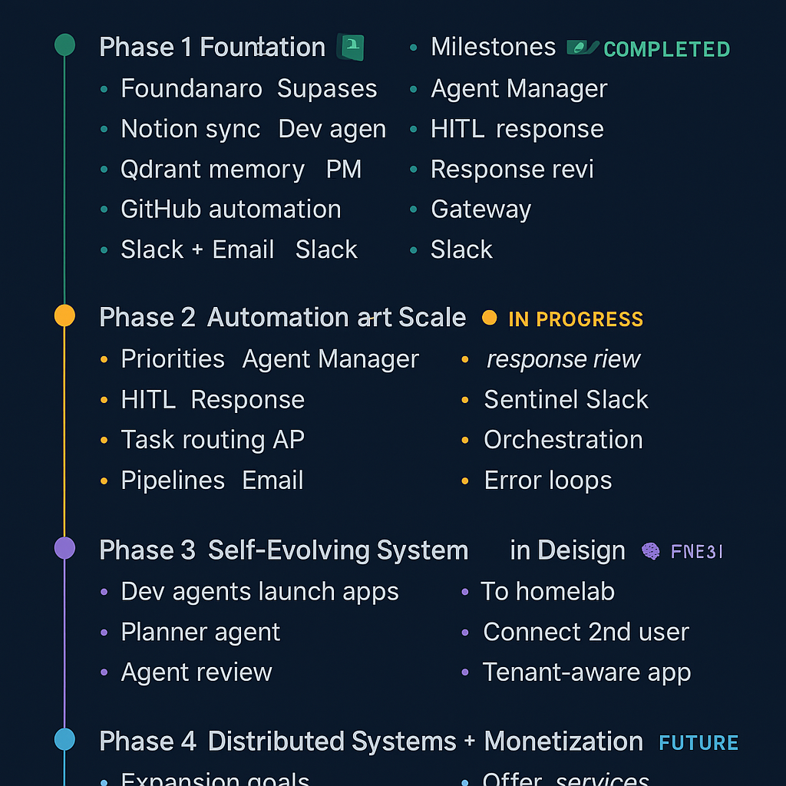

## 📍 `docs/roadmap.md`

```md
# 🗺️ GuardianAI Roadmap

> This is the living roadmap for building and scaling **GuardianAI** —  
> an agentic system that manages software, content, data, and infrastructure autonomously.

---

## ✅ Phase 1: Foundation — *[COMPLETED]*

**Status:** ✅ Stable  
**Focus:** Core automation loop, realtime event routing, and agent framework

### Milestones
- [x] Set up monorepo with apps + agents
- [x] Supabase tasks table with realtime triggers
- [x] Notion board sync + story creation
- [x] Dev agent logic (task generation, file scanning)
- [x] Qdrant memory system + embedding helpers
- [x] GitHub repo automation
- [x] PM2 process management
- [x] Slack + Email inbound + outbound
- [x] Orchestrator live + dry-run toggles
- [x] Guardian UI real-time dashboard

---

## 🚧 Phase 2: Automation at Scale — *[IN PROGRESS]*

**Status:** 🟡 Actively building  
**Focus:** End-to-end workflows, full agent coverage, reliable memory loop

### Priorities
- [ ] Fully working Agent Manager (create/update/delete agents)
- [ ] Agent dashboard views (Guardian UI)
- [ ] Task routing + reassignment logic
- [ ] HITL (Human-in-the-loop) via Slack
- [ ] Agent response review + PR review flows
- [ ] Dedicated cloud-native Gateway + zero-trust firewall
- [ ] Tailnet validation + secured service mesh
- [ ] Dedicated Docker + local persistent services
- [ ] Agentic Email pipeline (classification, tagging, trigger flow)
- [ ] Agentic Slack interpretation (intent + response)

---

## 🔮 Phase 3: Self-Evolving System

**Status:** 🧠 In design  
**Focus:** Agents building agents, recursive planning, continuous optimization

### Vision Features
- [ ] Dev agent launches new apps end-to-end from PRD
- [ ] Planner agent reflects on system-wide memory
- [ ] Agents review each other's work
- [ ] Sentinel agent monitors for drift + issues
- [ ] Project orchestration + timeline visualization
- [ ] Self-debugging error loops + automatic retries
- [ ] Nightly memory digestion + planning loop
- [ ] Book/blog/video content generated live from system usage
- [ ] Integrated Home Assistant + environmental state monitoring

---

## 🌐 Phase 4: Distributed System + Monetization

**Status:** 📡 Future  
**Focus:** Scaling, multi-user support, real monetization of GuardianAI stack

### Expansion Goals
- [ ] Move agents and services off laptop → homelab server
- [ ] Connect second user (family/team member) to GuardianAI
- [ ] Build tenant-aware agents (e.g. for clients or collaborators)
- [ ] Create commercial products from agent-built apps
- [ ] Offer GuardianAI as a platform-as-a-service
- [ ] Marketplace for agents, automations, tools

---

## 🧭 Milestone Tracker

| Milestone                    | Status |
|-----------------------------|--------|
| 🔁 Realtime automation loop | ✅ Done |
| 🧠 Long-term memory (Qdrant) | ✅ Done |
| 🔧 Agent management tools   | 🟡 WIP |
| 💬 Slack / Email pipelines  | ✅ Done |
| 🌍 Multi-source ingestion   | 🟡 WIP |
| 🔐 Full ingress security    | ✅ Done |
| 🚀 App deployment loop      | 🟡 In Progress |
| 📘 Documentation + system map | ✅ Ongoing |
| 🧑‍🏫 Book + content campaigns | 🟡 Starting Soon |

---

> GuardianAI is the blueprint for the future of **automated digital mastery**.  
> Build it. Run it. Teach it. Let it grow.

```



---

## Next Steps

You're absolutely right to start introducing **throttling, buffering, and observability** into the GuardianAI system now that most of your **inbound triggers are live**. Running a system like this continuously requires **strong control loops, human-in-the-loop (HITL) options, and safe execution boundaries**.

Let’s break it down step by step:

---

## 🧠 **Your Current State**
**Inbound Triggers Active:**
- ✅ Emails (Apps Script webhook → Gateway → Orchestrator)
- ✅ Slack (Bi-directional comms via app mentions + webhooks)
- ✅ Supabase (Realtime event sub to `tasks`, `memory`)
- ✅ File scanning (Monorepo and project files already parsed)
- ✅ Orchestrator (Polling or event-based task planning)
- ✅ Agents (running locally, triggered on task conditions)

---

## 🧯 **Risks of Running Continuously**
- Task storms (infinite planning loops or overwhelming triggers)
- Rapid Slack messages, Notion page floods, or email responses
- Supabase or Render rate limits
- Hard to debug because it’s *too fast to observe*

---

## ✅ **Ideal Features to Implement Now**

### 1. 🐢 **System-Wide Rate Limiting / Task Throttling**
Use one or more of:
- `sleep(ms)` or `setTimeout` between task dispatches
- `MAX_TASKS_PER_RUN = 5` to prevent unlimited planning
- Simple `.env` toggle: `ORCHESTRATOR_THROTTLE=true`
- Throttled queues like `p-limit` or `Bottleneck` (npm) for more control

**Example (Manual Throttle):**
```ts
for (const task of tasks.slice(0, MAX_TASKS_PER_RUN)) {
  await runTask(task)
  await sleep(1000); // 1s delay
}
```

---

### 2. 🔍 **Central Task Queue Dashboard**
- Show: `pending`, `in-progress`, `done`, `error`
- Buttons to: `Pause`, `Resume`, `Retry`, `Cancel`, `Assign`
- Think of it like a **Trello for your system’s brain**

---

### 3. 🛑 **Agent Activation Controls**
Create a table (or Supabase settings row) with:
| Agent        | Enabled | Cooldown | Notes                  |
|--------------|---------|----------|------------------------|
| dev-agent    | ✅      | 60s      | Working on PR #42      |
| slack-agent  | ✅      | 5s       | HITL always required   |
| content-agent| ⛔️      | N/A      | Needs reconfig         |

✅ Load this table on boot and control execution from it.

---

### 4. 🔔 **HITL Approval Checks**
Insert checkpoints before key automations:
- Before writing to Notion
- Before sending Slack messages
- Before committing or pushing code

**Example:**
```ts
const approved = await waitForSlackApproval(task)
if (!approved) return
```

---

### 5. 📈 **Live Monitoring Dashboard**
We should expand your dashboard to include:
- Agent status indicators (🟢/🔴)
- Current tasks in flight
- Last trigger timestamps
- Log output (or tail supabase logs)

---

### 6. ⚠️ **Loop Detectors**
You can track:
- Task `created_at` timestamps
- Count of same title tasks in last X mins
- Memory/event dedupe IDs

Then auto-cancel or alert you if:
```ts
if (sameTasks > 5 && timeWindow < 5min) {
  pauseAgent('orchestrator')
}
```

---

### 7. 🌐 **Environment Modes**
Use `.env` flags like:
- `SYSTEM_MODE=debug | observe | run`
- `SLACK_APPROVAL_MODE=true`
- `DISABLE_AGENTS=dev,qa,pm`
- `THROTTLE_DELAY=1000` (ms between tasks)

And control behavior via a shared config module.

---

## 🛠️ Next Steps Checklist

| Task | Status |
|------|--------|
| Add `sleep()` and max-per-run to orchestrator loop | ✅ Easy win
| Add Supabase table: `agent_settings` | ⏳ Add soon
| Add pause/resume to task dashboard | 🔨 In progress
| Implement Slack HITL for sensitive actions | 🔜
| Add memory of recent actions to prevent loops | 🔜
| Expose `.env` flags for rate limiting and agent toggles | ✅

---

## 🤖 Let’s Build It

We can scaffold any of the above components you’re ready for next:
- Dashboard tile to monitor and pause/resume agents
- `agent_settings` table + getter
- `sleep` + `MAX_TASKS_PER_RUN` patch
- Slack HITL logic wrapper
- Task dedupe checker

Let me know which you’d like to do first 💡